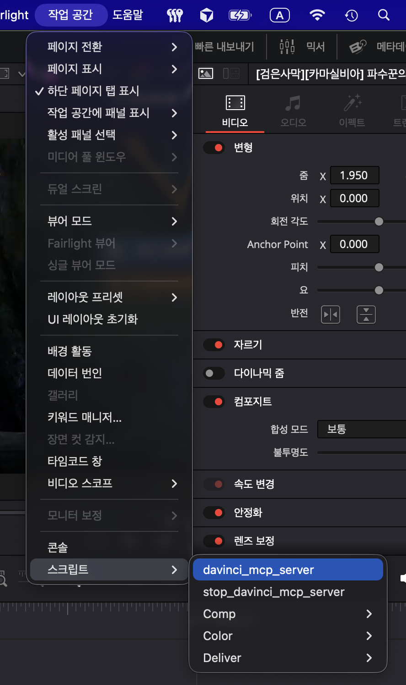
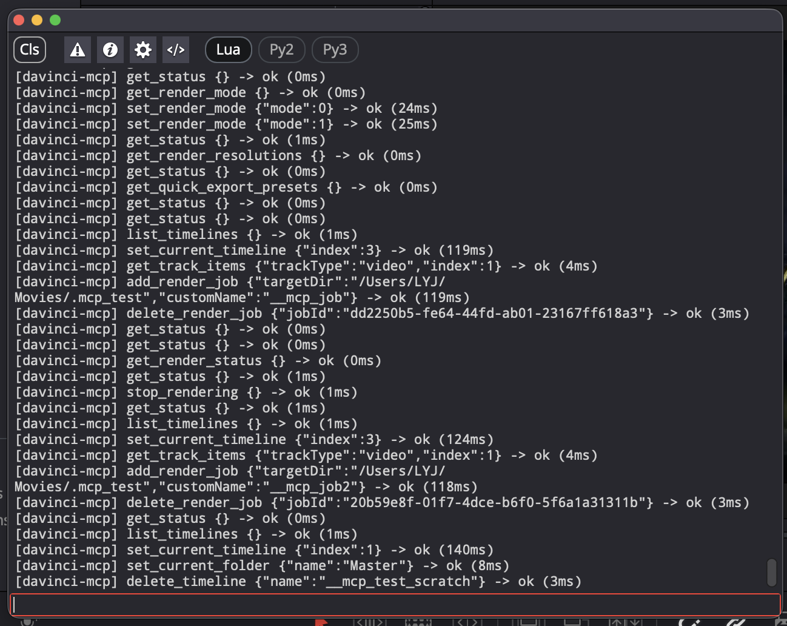

# davinci-resolve-lite-mcp

[](https://github.com/2sem/davinci-resolve-lite-mcp/actions/workflows/test.yml)

An [MCP](https://modelcontextprotocol.io) server that lets an AI client such as
**Claude Code** control **DaVinci Resolve** — including the **free (Lite)
edition**, which the existing
[davinci-resolve-mcp](https://github.com/samuelgursky/davinci-resolve-mcp)
project cannot drive.

The free edition blocks *external* scripting, but it still runs Python scripts
launched from its own **Workspace > Scripts** menu. This project rides that path:
the MCP server runs **inside** Resolve as a menu script, and exposes Resolve's
Python API over a small local HTTP endpoint that Claude connects to.

```
Claude Code ──HTTP JSON-RPC (MCP)──▶  127.0.0.1:8765/mcp
                                          │   server runs INSIDE Resolve
                                          │   (Workspace > Scripts > Utility)
                                          ▼
                              command queue → main script thread
                                          ▼
                              global `resolve` object → Resolve API
```

## Demo

Ask Claude in plain language; it drives Resolve through the tools. For example,
*"add an opening title that reveals **GameHelper**"* →
[`insert_fusion_title`](docs/TOOLS.md) + [`style_fusion_title`](docs/TOOLS.md)
build a Text+ title and edit its Fusion node graph (gold font, glow, a
zoom-in keyframe reveal):

<video src="docs/images/demo.mp4" controls muted playsinline width="720"></video>

See the [tools reference](docs/TOOLS.md) for the full 157-tool surface —
editing, color, render, media pool, and Fusion title styling.

## Why this works on the free edition

* Free Resolve permits scripts run from its **Scripts menu** (only *external*
  network scripting is restricted).
* A menu script gets the `resolve` object for free and may run a long-lived
  loop — long enough to host a server.
* The sandboxed Lite app ships the `com.apple.security.network.server`
  entitlement, so it can open a localhost listening socket.
* **Zero dependencies** — pure Python standard library. Nothing to `pip install`
  into Resolve's interpreter.

## Requirements

* macOS with DaVinci Resolve (Lite/free or Studio).
* Claude Code (or any MCP client that speaks the Streamable HTTP transport).

## Install

```bash
git clone https://github.com/2sem/davinci-resolve-lite-mcp.git
cd davinci-resolve-lite-mcp
./install.sh
```

`install.sh` deploys:

* the two launcher scripts into `Fusion/Scripts/Utility` (a folder Resolve scans
  for the Scripts menu; **Utility** shows on every page), and
* the `resolve_mcp` package into `Fusion/Scripts/MCP` — a folder Resolve does
  **not** scan, so the helper modules stay out of the menu.

The Lite container path is detected automatically.

> **Sandbox note (important).** DaVinci Resolve Lite is sandboxed and can only
> read its own container, `~/Movies`, and files you pick interactively. A
> symlink that points outside those locations (e.g. into a clone under
> `~/Projects`) **cannot be followed by the sandboxed app**, so the menu script
> would silently never run. For that reason `install.sh` **copies** the files
> into the container on Lite (and symlinks only on the non-sandboxed Studio
> build). **Re-run `./install.sh` after pulling updates.**
>
> Resolve enumerates only the category folders (`Utility / Comp / Tool / Edit /
> Color / Deliver`) for its Scripts menu — that is why the launchers go in
> `Utility` and the package hides in `MCP`.
>
> The same sandboxing applies to file paths you ask the tools to use:
> exports/imports should target `~/Movies` (or other granted locations),
> otherwise Resolve cannot write/read them.

## Run

1. In DaVinci Resolve: **Workspace > Scripts > Utility > davinci_mcp_server**.

   

2. Open **Workspace > Console** — it prints the endpoint and port:

   ```
   MCP endpoint:  http://127.0.0.1:8765/mcp
   Add to Claude Code:
     claude mcp add --transport http davinci http://127.0.0.1:8765/mcp
   ```

   > The startup guide prints to the Resolve Console (Workspace > Console).
   > Because the server runs continuously, its Console output can buffer until
   > it stops, so both scripts also mirror every line to a logfile:
   >
   > ```
   > ~/Movies/davinci-resolve-lite-mcp.log
   > ```
   >
   > Watch it live with `./logs.sh`. (Override the directory with
   > `DAVINCI_MCP_LOG_DIR`.) `~/Movies` is used because the sandboxed Lite app
   > is allowed to write there.

   Once running, every tool call is logged to the Console as a single line
   (`[davinci-mcp] <name> <args> -> ok|error (Nms)`):

   

3. Register it with Claude Code (one-time):

   ```bash
   claude mcp add --transport http davinci http://127.0.0.1:8765/mcp
   ```

   Then verify / reconnect with the **`/mcp`** command inside Claude Code — it
   lists connected servers and reconnects them. If Claude was already running
   when you launched the script, type `/mcp` (or restart the session) so it
   picks up the `davinci` server.

4. Ask Claude to control Resolve.

### Configure the port (stable, recommended)

By default the server listens on `8765` and **auto-increments to `8766`, `8767`,
… if that port is busy** (another local tool may already hold `8765`). Because
the winner of that race can change between launches, the URL you registered with
Claude can drift, surfacing as:

```
Failed to reconnect to davinci: HTTP 404 at http://127.0.0.1:8765/mcp
```

To lock the port for good, drop a small JSON config file. **When a port is set
this way it is *pinned* — the server binds exactly that port and never
auto-increments**, so you register Claude once and the URL never moves.

Create `~/Movies/davinci-resolve-lite-mcp.config.json`:

```json
{ "host": "127.0.0.1", "port": 8770 }
```

> **Why `~/Movies` and not `~/.config`?** The Lite app is sandboxed and can only
> read its own container, `~/Movies`, and files you pick interactively —
> `~/.config` is outside the sandbox, so Lite cannot read it (this is the same
> reason the logfile lives in `~/Movies`). The server also checks
> `~/.config/davinci-resolve-lite-mcp/config.json` for the **non-sandboxed
> Studio** build, where that path is conventional.

Then restart the server (Scripts > Utility > **stop_davinci_mcp_server**, then
**davinci_mcp_server**) and register Claude once at the fixed port:

```bash
claude mcp add --transport http davinci http://127.0.0.1:8770/mcp
```

The Console banner confirms the source — look for
`Port : pinned (from …) — will not auto-increment`.

**Resolution order** (highest priority first): the `DAVINCI_MCP_PORT` /
`DAVINCI_MCP_HOST` environment variables, then the config file, then the
built-in defaults. The env vars also pin the port, but a Dock-launched Resolve
won't see a shell `export`; the config file is the simplest persistent option.
`DAVINCI_MCP_CONFIG=/path/to.json` forces a specific config file **exclusively**
— if that path is missing or malformed the server falls back to the built-in
defaults rather than reading `~/Movies` / XDG.

If the port already drifted and Claude points at the wrong one, re-point it:

```bash
claude mcp remove davinci
claude mcp add --transport http davinci http://127.0.0.1:<actual-port>/mcp
```

### Stopping

Any of these stops the server:

* **From the menu:** Workspace > Scripts > Utility > **stop_davinci_mcp_server**
* **From a terminal:** `./stop.sh`
* **Quit DaVinci Resolve**

The menu stop script and `stop.sh` both POST to the server's `/shutdown`
endpoint, scanning the same port range the server uses on startup.

> The port auto-increments from `8765` only when it is **not** pinned. To lock
> it so the URL never moves between launches, see
> [Configure the port](#configure-the-port-stable-recommended).

## Tools

**157 tools**, all exercised live against DaVinci Resolve Lite, spanning the
full pipeline:

- **Status & navigation** — page switching, project/timeline settings
- **Projects & timelines** — load/create/duplicate, markers, scene cuts, lifecycle
- **Tracks** — add/delete, enable/lock/rename
- **Editing** — place/append/delete clips, titles & generators, transform/crop/zoom
- **Media pool & storage** — import/delete, properties & metadata, tagging, disk browse
- **Color** — node graph LUT/enable, reset grades, stills
- **Render & export** — render queue, formats/codec, frame/timeline/project export & import

See **[docs/TOOLS.md](docs/TOOLS.md)** for the complete per-tool reference.

Every tool call is logged to the Resolve Console and the logfile as a single
line: `[davinci-mcp] <name> <args> -> ok|error|EXCEPTION (Nms)`.

## Project layout

```
src/davinci_mcp_server.py        thin launcher (deployed to Scripts/Utility)
src/stop_davinci_mcp_server.py   stop launcher
src/resolve_mcp/                 the server package (deployed to Scripts/MCP, hidden)
    config · logio · connection · bridge · tools · server
tests/test_server.py             offline tests (fake Resolve, no app needed)
install.sh · uninstall.sh · stop.sh · logs.sh
docs/TOOLS.md                    full per-tool reference
fallbacks/                       documented gotchas + fixes
```

## Testing

- **Offline** (no Resolve, no server) — import + dispatcher + tool-count smoke:
  ```bash
  python3 tests/test_server.py
  ```
- **Live integration** — one test per tool against a running server (Resolve open
  with a project + a media clip, and `davinci_mcp_server` launched):
  ```bash
  python3 tests/live_test.py                 # all features
  python3 tests/live_test.py set_timecode    # run the test(s) for given feature(s)
  ```
  Each test name equals the tool name, so when you change a tool you can run just
  its test: `python3 tests/live_test.py <tool>`. Tests are reversible (scratch
  timeline + temp files, cleaned up). File-dependent and session-destructive
  tools are checked via their error path; Studio-only / heavy tools (e.g.
  `detect_scene_cuts`, `render_current_timeline`, `quick_export`) are skipped
  with a reason. A few marker / still tests depend on a clean Resolve session
  state — re-run them after a fresh launch if they flake.

## Contributing

See [CONTRIBUTING.md](CONTRIBUTING.md) for how to add a tool, run the suites,
the stdlib-only / Lite-first constraints, and the release flow.

## Scope

This server targets the **free (Lite) edition** and intentionally covers only
API that runs there. Studio-only / paid features are **deliberately omitted**
(they no-op or error on Lite), namely: audio transcription, subtitles-from-audio,
Magic Mask, Stabilize, Smart Reframe, Dolby Vision analysis, Voice Isolation,
and cloud projects / database management. The remaining unwrapped methods are
trivial accessors (`GetUniqueId`, cache modes, Fusion-comp internals, takes,
stereo/3D, layout & burn-in presets, mattes) — not functional gaps.

## Known limitations

- Clips can be addressed by **name** (within the current media-pool folder) or
  by **id** (`id`/`ids`, resolvable across any bin) — pass `id`/`ids` when names
  are ambiguous or the clip lives in another folder.
- Tool arguments are validated against each tool's JSON Schema (required fields,
  basic types, and enums); a malformed call returns a clear error naming the
  offending argument. Deep/nested schema constraints are not exhaustively checked.

## Security note

The server binds to `127.0.0.1` only, so it is reachable from your machine
only. It exposes control of DaVinci Resolve to any local process that can reach
the port — only run it on a machine you trust.

## License

MIT — see [LICENSE](LICENSE).
